  

 

<!-- TARJETA DE PRESENTACIÓN ESTILO NEON -->

  <table style="background-color: #0D0D0D; border: 1px solid #00FFFF; border-radius: 20px; padding: 20px; box-shadow: 0 0 15px #00FFFF;">
    <tr>
      <td align="center">
        <h3 style="color: #00FFFF;"> Bienvenid@ 👋 </h3>
        <h4 style="color: #00FFFF;"> Mi nombre es José, y soy un programador en ascenso . A continuación, te comparto unas cosas sobre mí👆📈 </h4>
        
💻 Ing. Informático | 🪨 ► 💎 Haciendo diferencia con criterio... 

        
📍 Región Metropolitana | 📫 andradejosemanuel159@gmail.com | 🌐 linkedin.com(proximamente)

        

          🔧 Tecnologías preferidas: 
            
          
          
          
        

      </td>
    </tr>
  </table>

 

<!-- PROYECTOS DESTACADOS -->
<h2 align="center" style="color: #00FFFF; border-bottom: 2px solid #00FFFF; display: inline-block;">🚀 Proyectos Destacados</h2>

  

  <table>
    <tr>
      <td>
        

          
          
📱 App Móvil React Native

          
Aplicación de utilidad para con vehículos

        

      </td>
      <td>
        

          
          
🤖 Espectador de pantalla con IA

          
Visualización y respuestas con contexto

        

      </td>
      <td>
        

          
          
📊 Gestor de ventas de cafetería

          
Visualización de datos con Python

        

      </td>
    </tr>
  </table>

 

<!-- LENGUAJES Y TECNOLOGÍAS -->
<h2 align="center" style="color: #00FFFF; border-bottom: 2px solid #00FFFF; display: inline-block;">🧠 Lenguajes y Tecnologías</h2>

 

  
  
JavaScript · TypeScript · Python · Java · React · Node.js · Docker · Kubernetes · y más

 

<h2 align="center" style="color: #00FFFF; border-bottom: 2px solid #00FFFF; display: inline-block;">📊 Lenguajes más usados</h2>

 

  
   
  📌 Actualizado automáticamente con cada push

 

<!-- ANIMACIÓN NEON ADICIONAL -->

  
   
  
    
  
✨ <b>Always locked in</b> ✨

